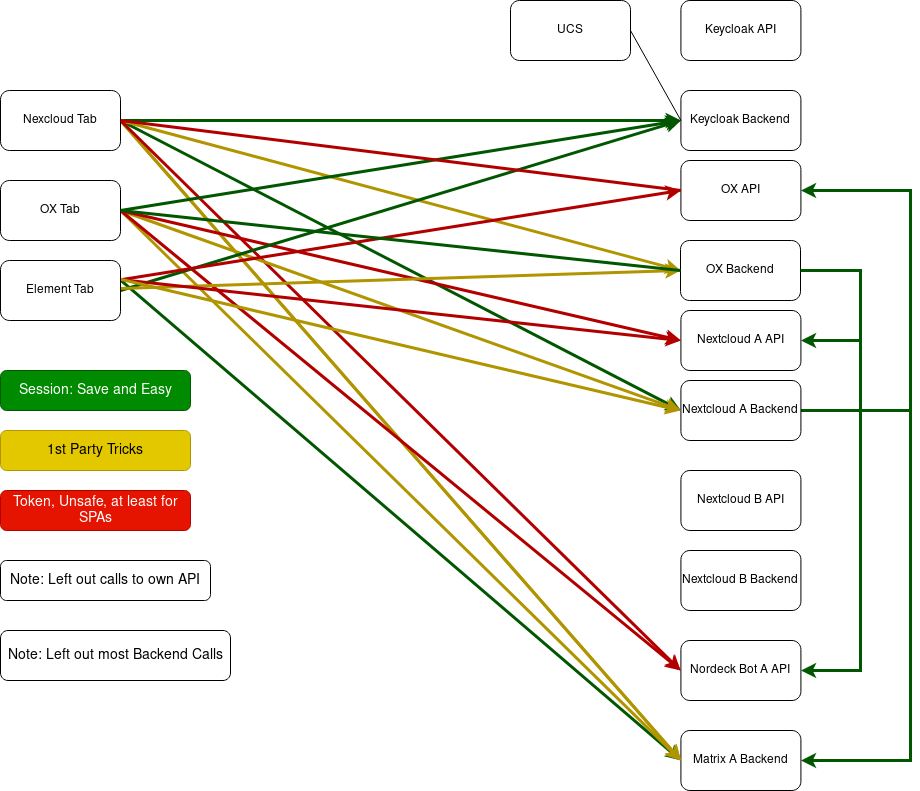
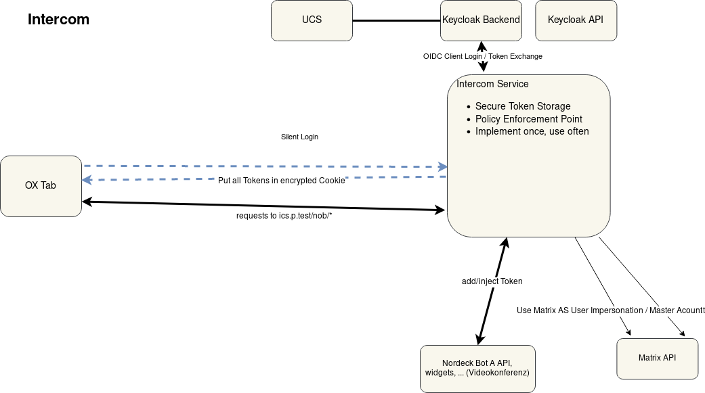

# Introduction / The Problems
The main goal of Phoenix is to combine existing Software in a way that the user experiences it as one piece of software.
Since every App is running on different subdomains, we have to deal with braking the Same Origin Policy [^1]

The user logs in once, is logged-in in every App and these Apps can interact with each other
(for example attach files from nextcloud to ox emails). The Single Login is achieved via OIDC but OIDC gives no provisions
for the interaction of services[^2]. 

Further Tokens are normally obtained via the Authorization Code Flow since all other flows are considered insecure 
(for web applications)[^3] This flow is based on redirects, which do pose difficult challenges for most Frontends, 
for example OX can't handle redirects after the login.

Another Problem are SPAs (Single Page Apps) without a dedicated backend. Secure, httponly cookies are currently the 
only secure way to store tokens in the Browser. There are different possibilities to "hide" the Credentials in JS but
none of these is considered secure. To remedy this Problem, the BFF (Backend for Frontend) oder Token Handler Pattern 
can be used[^5]

Phoenix is set to grow and incorporate different Apps, including 3rd Party Vendors which can't be totally trusted / bring
GDPR issues. So the Applications can't use a master key which gives global access but have to get individual credentials
and give permissions/consent on a user based level. With a growing number of interactions, this means more work for all 
Vendors.

possible categories:
* Single Sign On
* Cross Service Communication
* Credential / Token Storage
* "Master Key" / Vendor Specific Auth
* Exponential Growth of possible Interactions

Last but not least, every Interaction can be either directly from Frontend A to Backend/API B or routed through the backend.

# Introduction / The Solution / The Intercom Service
* To get secure storage, we use something like the BFF / Token Handler Pattern
* To get the initial credentials, we use OIDC
* To avoid the redirect Problem and the "Master Key" Problem, we use a trusted service (the intercom)
which uses the keycloak token exchange to downgrade the oidc access token for the Userinfo Endpoint to Application/Vendor specific Tokens.
* To solve the problem to auth every service with every other service, all cross service requests go through the intercom.
The intercom injects the needed Credentials on the Server Side and they are never exposed to the Browser.
* Note: Backend to Backend Communication is not included yet, see the corresponding draft in the diagrams folder.

# Frontend Auth
## Silent Login
## Required Headers, Cookie Flags, ...

[^1] https://developer.mozilla.org/en-US/docs/Web/Security/Same-origin_policy

[^2] There is an access Token provided but this is only intended for the client to access to IdPs Userinfo endpoint.
Since this token is for accessing the users private data, it must not be passed around to other services.
https://openid.net/specs/openid-connect-basic-1_0.html#ObtainingTokens

[^3] "Browser-based applications MUST use the OAuth 2.0 Authorization Code flow with the PKCE extension when obtaining an access token" https://datatracker.ietf.org/doc/html/draft-ietf-oauth-browser-based-apps

[^4] https://datatracker.ietf.org/doc/html/draft-ietf-oauth-browser-based-apps 6.3

[^5] https://curity.io/resources/learn/the-token-handler-pattern/
