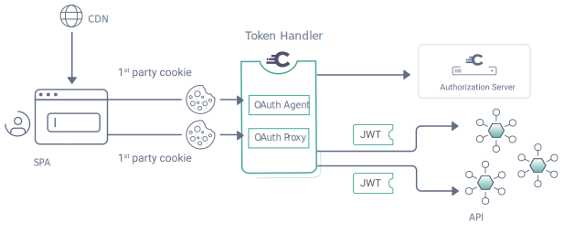

# Anforderungen Intercom
## Kommunikation von Frontend a mit Backend b via Intercom (Proxy / Token Handler Pattern)
* Intercom ist OIDC RP, unterstützt Single Login/Logout
* Silent Login für andere Dienste
* Session Monitoring/Handling?
  * Müssen andere Dienste ihren Intercom Session Status monitorn (und ihren Keycloak status monitoren?)
  * Timeouts, Refresh Token handling: Wie lange können wir Timeouts setzen, benötigen wir Oauth Refresh Tokens / Matrix Token refresh stuff?
  * Herausforderung Cookie Sessions vs Tokens (Element vs Rest), 
* Nutzung als Policy Decision Point, Zugriffsrechte die irgendwo definiert werden müssen vom Intercom durchgesetzt werden 

## Kommunikation von Backend a mit Backend b via Intercom
* Storage von Credentials für die Dienste
* Jeder Dienst muss nur mit den Intercom sprechen und nicht eine lange Liste von Credentials abspeichern
* Nutzung als Policy Decision Point

# Option Fully Fledged BFF / Token Handler / API Gateway Microservice Style
## Einleitung
In einem SSO Szenario muss jeder Dienst eine Fülle von Auth Anforderungen erfüllen / implementieren. 
Single Sign In/Out, Auth für Cross Service Communication, Timeouts, ... 

Bei potentiell 100+ Microservices wird klar das dieser Ansatz keinen Erfolg verspricht. Statt dessen wird meist die Auth 
von einem API Gateway übernommen das zB OIDC RP gegenüber Keycloak ist und jeden Request an die Dienste
proxied und per Header Fields mit den nötigen Tokens versieht. 

### Beispiel Netflix / Zuul

Quelle: https://www.techaheadcorp.com/blog/design-of-microservices-architecture-at-netflix/
https://github.com/Netflix/zuul/wiki
Netflix uses Zuul for the following:

    Authentication
    Insights
    Stress Testing
    Canary Testing
    Dynamic Routing
    Service Migration
    Load Shedding
    Security
    Static Response handling
    Active/Active traffic management
### Beispiel Curity Token Handler

Quelle: https://curity.io/resources/learn/the-token-handler-pattern/

### Beispiel KrakenD

Quelle: https://www.krakend.io/
# Anforderungen
## Jeden Request proxi'en 
